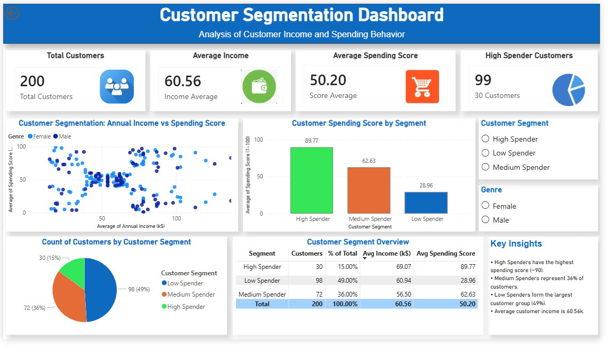

# Customer Segmentation Analysis

## Overview
This project performs customer segmentation using machine learning and visualizes the results through an interactive Power BI dashboard.

## Tools & Technologies
- Python
- Pandas
- NumPy
- Scikit-learn
- Matplotlib
- Power BI

## Dataset
Mall Customers Dataset

## Project Workflow
1. Data Cleaning & Preprocessing
2. Customer Analysis
3. Customer Segmentation
4. Data Visualization
5. Power BI Dashboard Creation

## Dashboard Preview

## Files Included
- Customer Segmentation-ml.ipynb
- Thiranex Project02.pbix
- Mall_Customers.csv
- dashboard.png

## Author

Geethu M

Aspiring Data Analyst | Python | Power BI | Machine Learning
